## 关于 Scope

> Scope is a mechanism in OAuth 2.0 to limit an application's access to a user's account. An application can request one or more scopes, this information is then presented to the user in the consent screen, and the access token issued to the application will be limited to the scopes granted.
> —— 以上内容节选自[oauth.net](https://oauth.net/)《OAuth Scopes》

简单翻译版 “Scope” 是OAuth 2.0中的一种机制，用于限制 OAuth 应用对用户帐户的访问范围。应用程序可以请求一个或多个 Scope，然后这些信息将在用户授权页中呈现给用户，而向应用程序发出的访问令牌（access token）将被限制在授予的 scope 内（即所有超出当前授权 scope 的用户资源都将不可见）。

如上描述，Scope 是 OAuth 授权流程中非常重要的一个权限管理机制的配置参数，它可以限制应用程序对用户帐户资源的访问权限。

了解了基本概念，接下来，本文将详细介绍如果通过 JustAuth 实现自定义 Scope 授权。

## 自定义 Scope 接入 Google 平台

### 关于 scope 相关的注解说明

> 这儿需注意，并不是每个平台都支持自定义 scope，平台是否支持需要视第三方的 API 能力。所有支持自定义的平台如下：
> 百度、Coding、FaceBook、Gitee、Github、Gitlab、Google、华为、京东、酷家乐、领英、微软、小米、Pinterest、QQ、人人、Stackoverflow、微信公众平台和微博。
> 所有 scope 参数都在 `me.zhyd.oauth.enums.scope` 包下。

以 `me.zhyd.oauth.enums.scope.AuthGoogleScope` 为例，每个平台的 scope 注解都支持三个参数：

```java
// 具体的 scope 值
private String scope;
// scope 的用途说明
private String description;
// 是否为平台默认
private boolean isDefault;
```

所有被标为 `isDefault` 的 scope 都表示为该平台默认的 scope 值，即如果不传 scope 的情况下，默认使用被标注为`isDefault`的scope。

如 Google 平台默认的 scope 为三个：

```java
USER_OPENID("openid", "Associate you with your personal info on Google", true),
USER_EMAIL("email", "View your email address", true),
USER_PROFILE("profile", "View your basic profile info", true),
```

另外， 针对 Google 平台， JA 还根据具体的用户权限，封装了特定的 scope，如下：

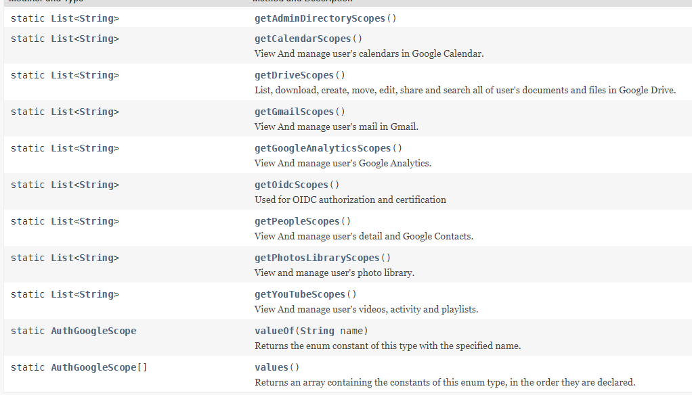

详细说明请参考 JA 的 API 文档：https://apidoc.gitee.com/yadong.zhang/JustAuth/me/zhyd/oauth/enums/scope/AuthGoogleScope.html

开发者可以视具体情况进行选择使用。

### 使用 scope 参数

本文将以 Google 平台演示 scope 的作用，关于 Google 平台的接入方法，请参考：[Google登录](https://justauth.wiki/#/oauth/google)。

在使用自定义 scope 时，只需要在原来使用方法的基础上做如下调整：

```java
authRequest = new AuthGoogleRequest(AuthConfig.builder()
    .clientId("xxx")
    .clientSecret("xxx")
    .redirectUri("http://localhost:8443/oauth/callback/google")
    .scopes(CollectionUtil.addAllIfNotContains(AuthGoogleScope.getPeopleScopes(), AuthGoogleScope.getGmailScopes()))
    // 针对国外平台配置代理
    .httpConfig(HttpConfig.builder()
            .timeout(15000)
            .proxy(new Proxy(Proxy.Type.HTTP, new InetSocketAddress("127.0.0.1", 10080)))
            .build())
    .build());
```

`scope`参数为 `List<String>` 类型，开发者可以自己传入任意有效的 scope 值，也可以使用 JA 提供的相关工具方法。JA 提供了工具类 `me.zhyd.oauth.utils.AuthScopeUtils` 进行支持，该类提供如下方法：

```java
// 获取 AuthScope 数组中所有的被标记为 default 的 scope
static List<String>	getDefaultScopes(AuthScope[] scopes)

// 从 AuthScope 数组中获取实际的 scope 字符串
static List<String>	getScopes(AuthScope... scopes)
```

#### 使用方法一: 使用默认 scope

```java
authRequest = new AuthGoogleRequest(AuthConfig.builder()
    .clientId("xxx")
    .clientSecret("xxx")
    .redirectUri("http://localhost:8443/oauth/callback/google")
    .scopes(AuthScopeUtils.getDefaultScopes(AuthGoogleScope.values()))
    // 针对国外平台配置代理
    .httpConfig(HttpConfig.builder()
            .timeout(15000)
            .proxy(new Proxy(Proxy.Type.HTTP, new InetSocketAddress("127.0.0.1", 10080)))
            .build())
    .build());
```

#### 使用方法二: 使用指定的 scope 

```java
authRequest = new AuthGoogleRequest(AuthConfig.builder()
    .clientId("xxx")
    .clientSecret("xxx")
    .redirectUri("http://localhost:8443/oauth/callback/google")
    .scopes(AuthScopeUtils.getScopes(AuthGoogleScope.USER_EMAIL, AuthGoogleScope.USER_PROFILE, AuthGoogleScope.USER_OPENID))
    // 针对国外平台配置代理
    .httpConfig(HttpConfig.builder()
            .timeout(15000)
            .proxy(new Proxy(Proxy.Type.HTTP, new InetSocketAddress("127.0.0.1", 10080)))
            .build())
    .build());
```

#### 使用方法三: 使用指定的 scope

```java
authRequest = new AuthGoogleRequest(AuthConfig.builder()
    .clientId("xxx")
    .clientSecret("xxx")
    .redirectUri("http://localhost:8443/oauth/callback/google")
    .scopes(Arrays.asList(
        AuthGoogleScope.USER_EMAIL.getScope(),
        AuthGoogleScope.USER_PROFILE.getScope(),
        AuthGoogleScope.USER_OPENID.getScope()
    ))
    // 针对国外平台配置代理
    .httpConfig(HttpConfig.builder()
            .timeout(15000)
            .proxy(new Proxy(Proxy.Type.HTTP, new InetSocketAddress("127.0.0.1", 10080)))
            .build())
    .build());
```

#### 使用方法四: 使用指定的 scope

此方法变种于方法三

```java
authRequest = new AuthGoogleRequest(AuthConfig.builder()
    .clientId("xxx")
    .clientSecret("xxx")
    .redirectUri("http://localhost:8443/oauth/callback/google")
    .scopes(Arrays.asList("openid", "email", "profile"))
    // 针对国外平台配置代理
    .httpConfig(HttpConfig.builder()
            .timeout(15000)
            .proxy(new Proxy(Proxy.Type.HTTP, new InetSocketAddress("127.0.0.1", 10080)))
            .build())
    .build());
```

#### 使用方法五: 组合使用

此方法变种于方法三

```java
authRequest = new AuthGoogleRequest(AuthConfig.builder()
    .clientId("xxx")
    .clientSecret("xxx")
    .redirectUri("http://localhost:8443/oauth/callback/google")
    .scopes(CollectionUtil.addAllIfNotContains(AuthGoogleScope.getPeopleScopes(), AuthGoogleScope.getGmailScopes()))
    // 针对国外平台配置代理
    .httpConfig(HttpConfig.builder()
            .timeout(15000)
            .proxy(new Proxy(Proxy.Type.HTTP, new InetSocketAddress("127.0.0.1", 10080)))
            .build())
    .build());
```


**如上所述，`scope`参数为 `List<String>` 类型，开发者可以自己传入任意有效的 scope 值。**

## 使用了自定义 scope 后的授权流程

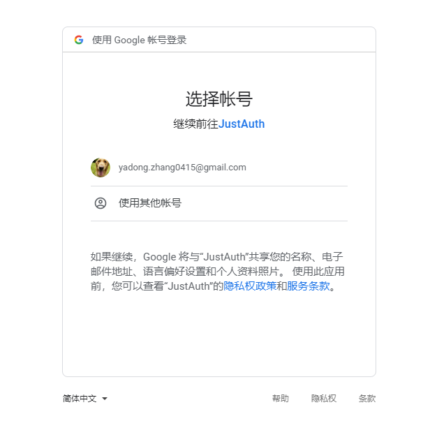
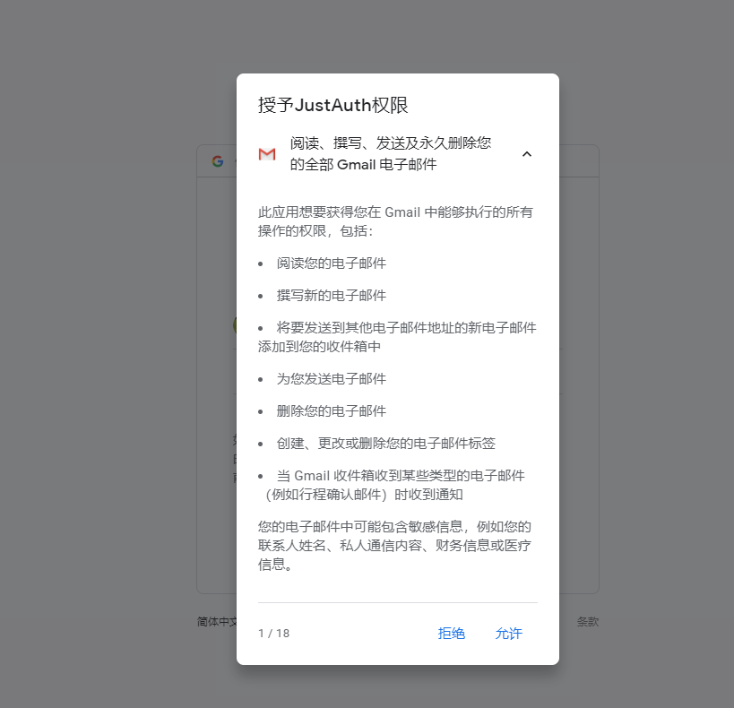
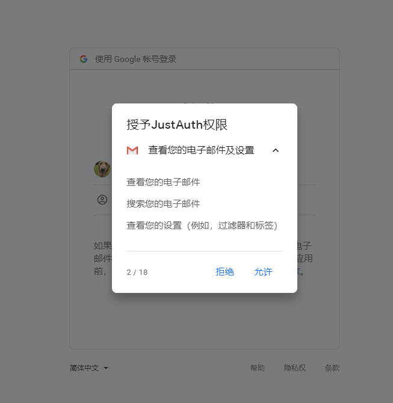
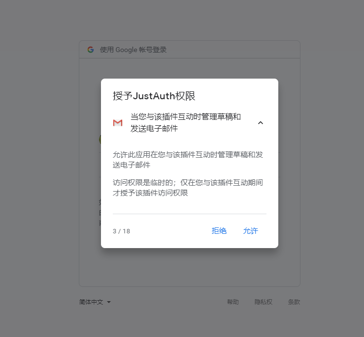
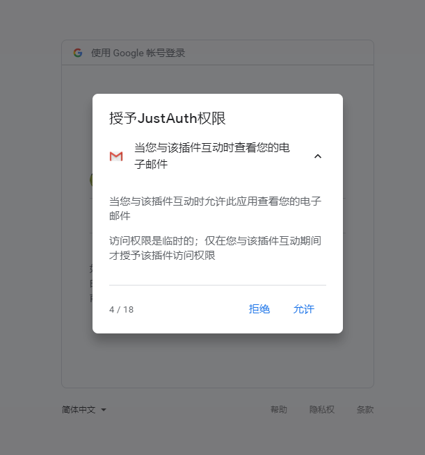
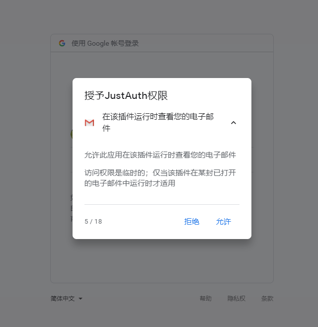
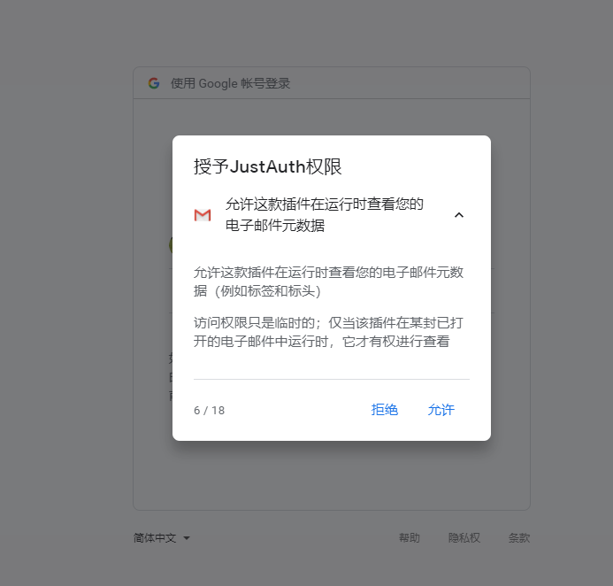
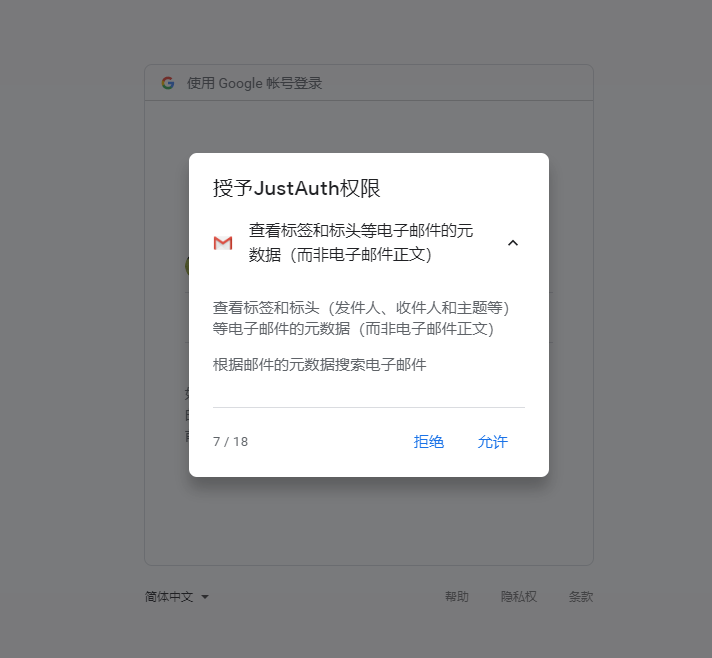
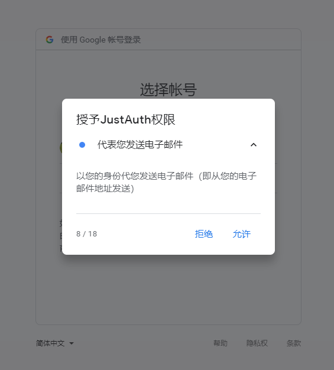
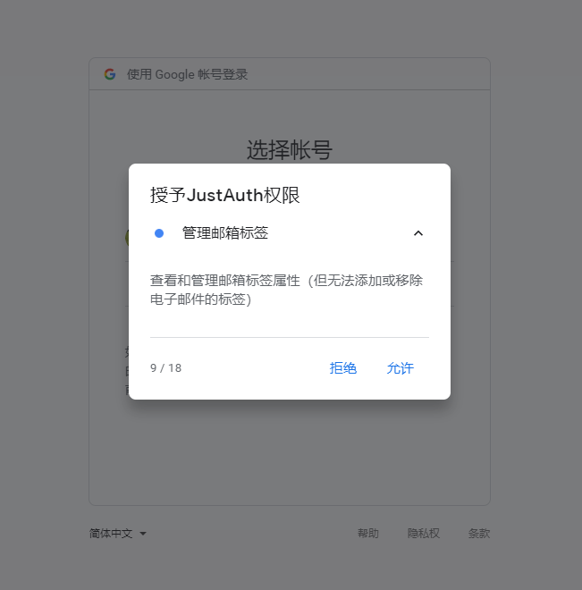
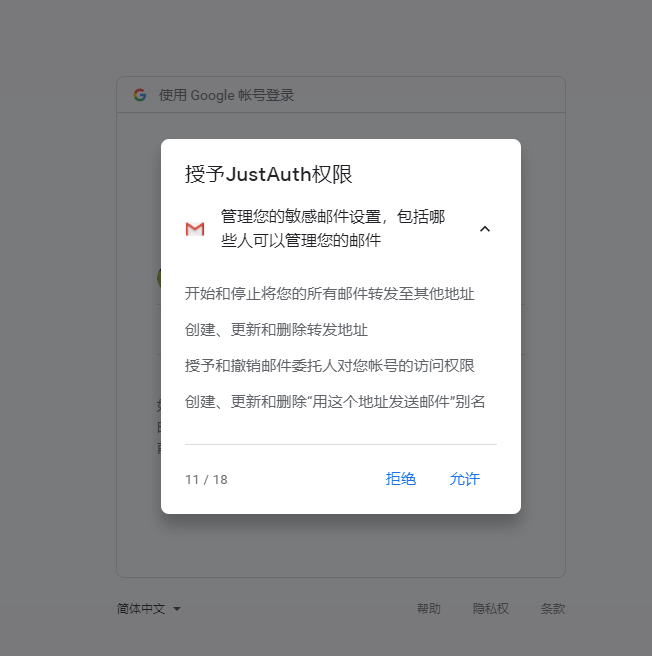
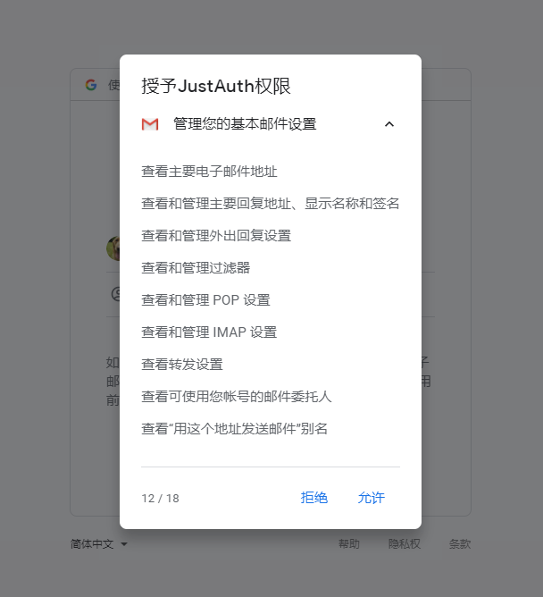
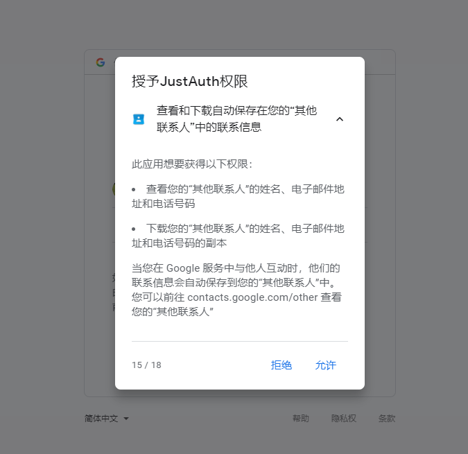
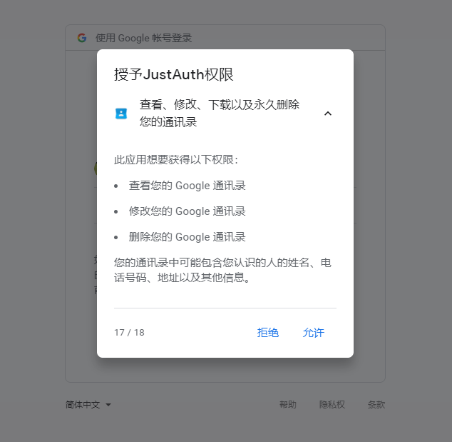
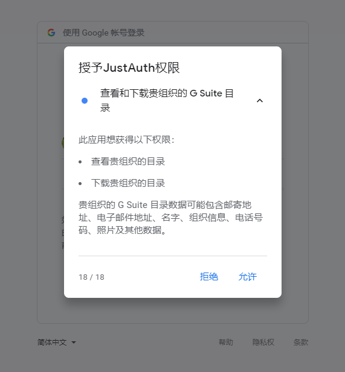
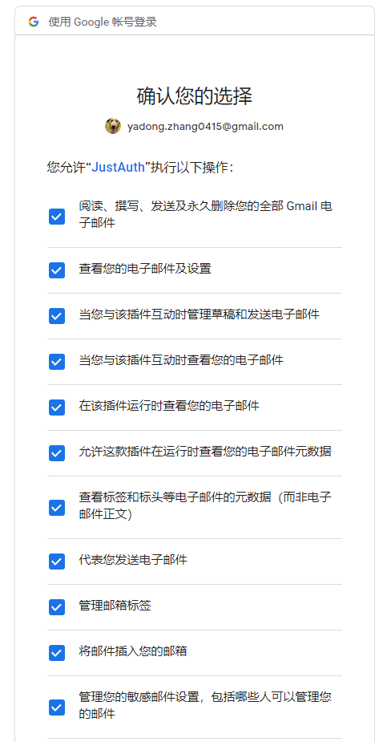

## 其他平台的授权页面

微软：
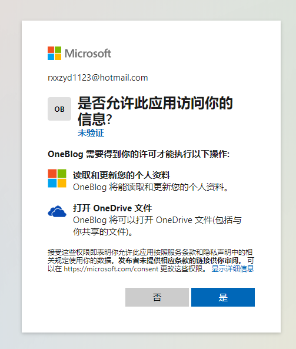

Pinterest：
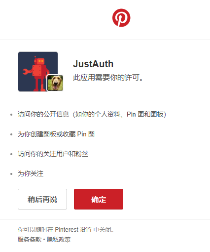


## 参考资料
- [OAuth Scopes](https://oauth.net/2/scope/)
- JustAuth 集成的平台中，允许自定义 scope 的平台文档 
    - Baidu: http://developer.baidu.com/wiki/index.php?title=docs/oauth#.E6.8E.88.E6.9D.83.E6.9D.83.E9.99.90.E5.88.97.E8.A1.A8
    - Github: https://developer.github.com/apps/building-oauth-apps/understanding-scopes-for-oauth-apps/
    - Dingtalk: https://ding-doc.dingtalk.com/doc#/serverapi2/kymkv6
    - Weibo: http://developer.baidu.com/wiki/index.php?title=docs/oauth/list
    - Coding: https://help.coding.net/docs/project/open/oauth.html#scope-%E5%8F%82%E6%95%B0
    - QQ: https://wiki.connect.qq.com/api%E5%88%97%E8%A1%A8
    - 微信公众平台: https://developers.weixin.qq.com/doc/offiaccount/OA_Web_Apps/Wechat_webpage_authorization.html
    - Google: https://developers.google.com/identity/protocols/oauth2/scopes
    - Facebook: https://developers.facebook.com/docs/facebook-login/permissions/
    - Microsoft: https://docs.microsoft.com/zh-cn/graph/permissions-reference
    - 人人: http://open.renren.com/wiki/%E6%9D%83%E9%99%90%E5%88%97%E8%A1%A8
    - stack overflow: https://api.stackexchange.com/docs/authentication#scope
    - 华为: https://developer.huawei.com/consumer/cn/doc/30101
        - 云空间服务：https://developer.huawei.com/consumer/cn/doc/development/HMSCore-Guides-V5/server-dev-0000001050039664-V5
    - 企业微信: https://open.work.weixin.qq.com/api/doc/90000/90135/91022
    - 酷家乐: https://open.kujiale.com/open/apps/2/docs?doc_id=95#Step1%EF%BC%9A%E8%8E%B7%E5%8F%96Authorization%20Code
    - Pinterest: https://developers.pinterest.com/docs/api/overview/?#scopes
    - 领英
        - Migrating From Default Permission Scopes：https://docs.microsoft.com/en-us/linkedin/shared/references/migrations/default-scopes-migration
        - share-api: https://docs.microsoft.com/en-us/linkedin/marketing/integrations/community-management/shares/share-api
    
