## 1. 配置应用

### 1.1 创建应用

#### 1. 进入支付宝开放平台（[open.alipay.com](https://open.alipay.com)）并登录
#### 2. 点击“进入我的开放平台”
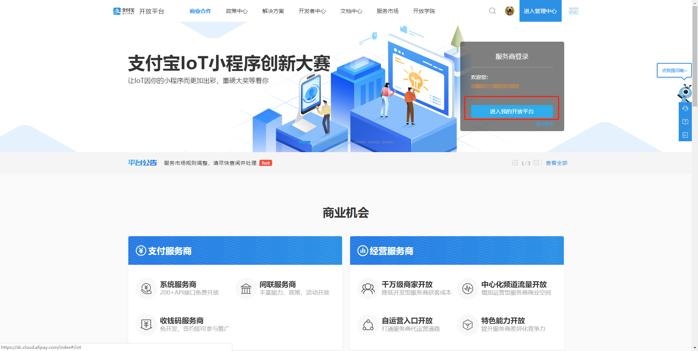
#### 3. 通过 **开发者中心-网页&移动应用** 进入应用管理列表页
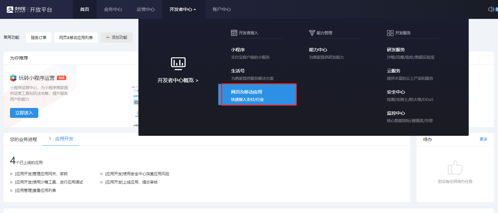
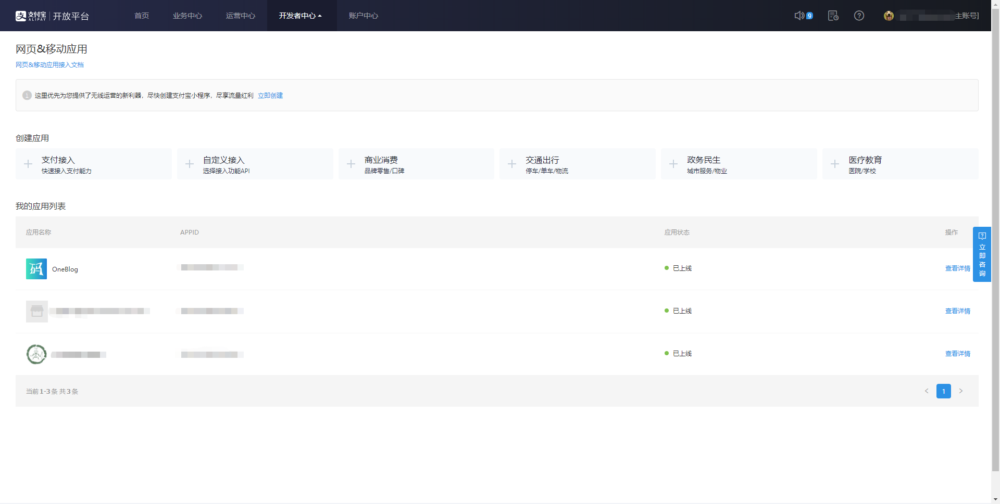
#### 4. 选择创建 **自定义接入** 应用

#### 5. 填入相关信息确认创建
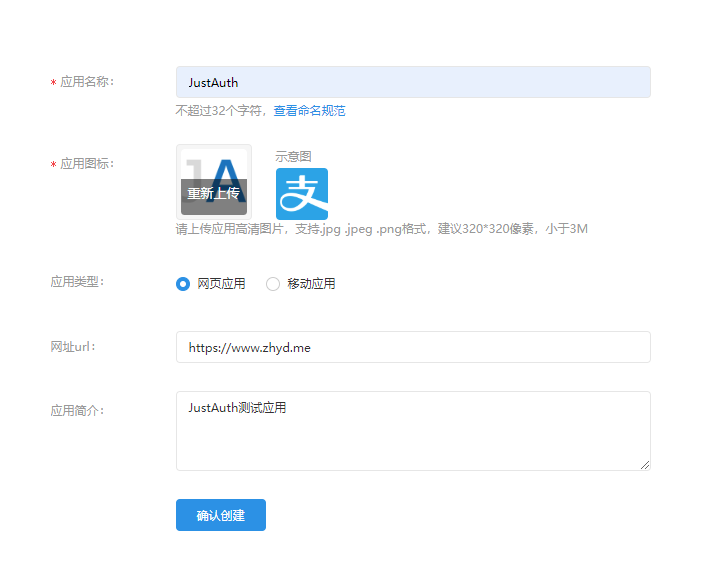
#### 6. 进入应用详情后，点击【功能列表】中的【**+添加功能**】按钮，选择【获取会员信息】
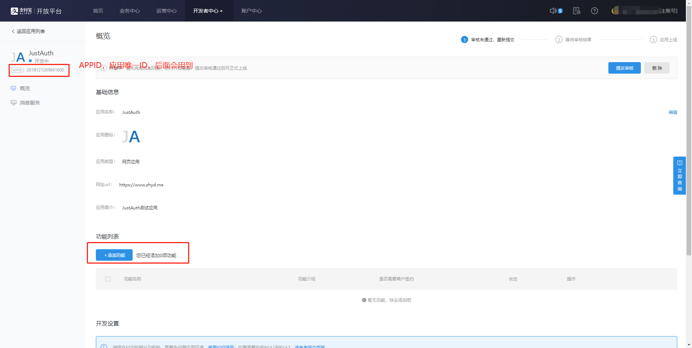
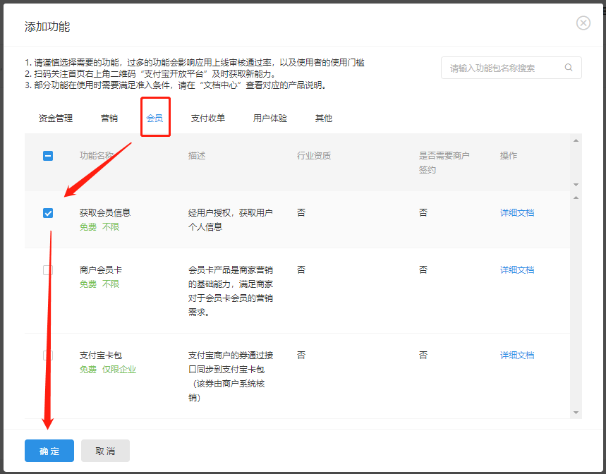

### 1.2 配置密钥
开发者调用接口前需要先生成RSA密钥，RSA密钥包含应用私钥(APP_PRIVATE_KEY)、应用公钥(APP_PUBLIC_KEY）。生成密钥后在开放平台开发者中心进行密钥配置，配置完成后可以获取支付宝公钥(ALIPAY_PUBLIC_KEY)。

接下来我们要在【应用详情】最下面的【开发设置】中，配置密钥相关的内容
#### 1. 接口加签方式
此处生成密钥的详细说明可以参考：[生成 RSA 密钥 ](https://docs.open.alipay.com/291/105971/)

我们这儿简单介绍一种使用“公钥”加签的方式

a. 首先下载密钥生成工具：[Windows版](https://ideservice.alipay.com/ide/getPluginUrl.htm?clientType=assistant&platform=win&channelType=WEB)（请不要安装在含有空格的目录路径下） | [MAC_OS版](https://ideservice.alipay.com/ide/getPluginUrl.htm?clientType=assistant&platform=mac&channelType=WEB)

b. 点击 【生成密钥】 后，工具会自动生成商户应用公钥（public key）和应用私钥（private key），如下图所示：

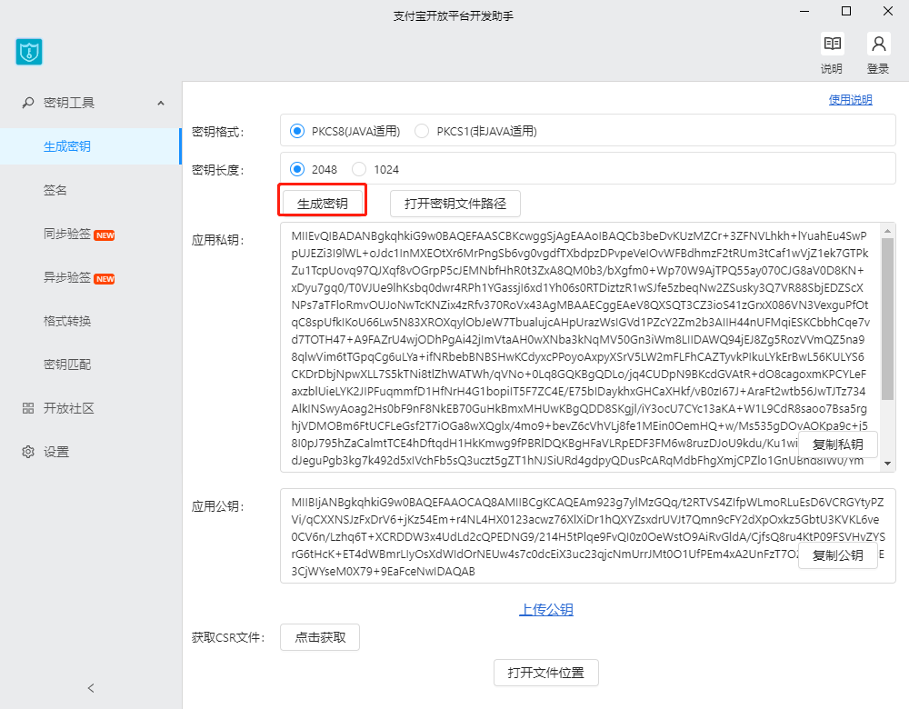

点击工具界面下方的 【打开文件位置】，即可找到生成的公私钥文件，这儿需要注意！

工具默认打开的是CSR目录，并不是我们生成的密钥的目录，如下图：


我们只需要往前返回一级目录，就可看到 RSA密钥 文件夹，进入 RSA密钥 目录后就可看到我们刚刚生成的密钥文件，如下图所示：


注意：应用私钥需要在JustAuth中配置。

c. 回到应用详情页面，点击【接口加签方式】后面的【设置】按钮，【加签模式】中选择【公钥】，然后在下方输入框中输入之前生成的【应用公钥2048.txt】文件内容

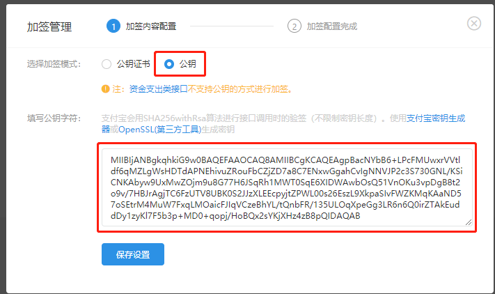

保存设置后，将会生成一份【支付宝公钥】，注意：这个公钥会在OAuth中使用！

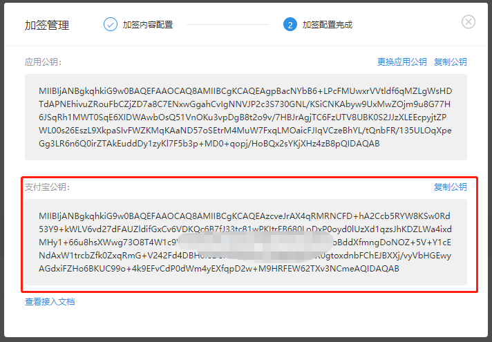

**注意：**

生成的私钥需**妥善保管，避免遗失，不要泄露**。应用私钥需填写到代码中供签名时使用。应用公钥需提供给支付宝账号管理者上传到支付宝开放平台。

#### 2. 接口加签方式

关于IP白名单的配置方式，请参考：[开放平台 IP 白名单接入指南 ](https://docs.open.alipay.com/200/ipwhitelist)

#### 3. 支付宝网关

使用默认的即可：https://openapi.alipay.com/gateway.do

#### 4. 应用网关

这是选填字段，主要用来接收支付宝的异步通知。请开发者视个人情况选择使用

#### 5. 授权回调地址

这是关键内容，JustAuth中需要用到。比如本例配置的回调地址为：https://www.zhyd.me/oauth/callback/alipay


以上步骤比较繁杂，主要需要注意保存的信息为：
- 使用【支付宝开放平台开发助手】生成的【应用私钥】(应用私钥2048.txt)
- 配置【接口加签方式】时生成的【支付宝公钥】
- 授权回调地址
- APPID（应用详情左侧应用名称下方有标注）

### 1.3 应用提交审核

通过应用详情上方的【提交审核】按钮，将应用提交审核，大约需要1天左右。（ps：本例的应用，我从提交审核到审核完成，大约用了两个小时）

## 2. 集成JustAuth


### 2.1 引入依赖

```xml
<dependency>
  <groupId>me.zhyd.oauth</groupId>
  <artifactId>JustAuth</artifactId>
  <version>${latest.version}</version>
</dependency>
```

```xml
<dependency>
	<groupId>com.alipay.sdk</groupId>
	<artifactId>alipay-sdk-java</artifactId>
	<version>3.7.4.ALL</version>
</dependency>
```

`${latest.version}`表示当前最新的版本，可以在[这儿](https://github.com/justauth/JustAuth/releases)获取最新的版本信息。

### 2.2 创建Request

```java
AuthRequest authRequest = new AuthAlipayRequest(AuthConfig.builder()
                .clientId("APPID")
                .clientSecret("应用私钥")
                .alipayPublicKey("支付宝公钥")
                .redirectUri("https://www.zhyd.me/oauth/callback/alipay")
                .build());
```

### 2.3 生成授权地址

我们可以直接使用以下方式生成第三方平台的授权链接：
```java
String authorizeUrl = authRequest.authorize(AuthStateUtils.createState());
```
这个链接我们可以直接后台重定向跳转，也可以返回到前端后，前端控制跳转。前端控制的好处就是，可以将第三方的授权页嵌入到iframe中，适配网站设计。


### 2.4 以上完整代码如下

```java
import me.zhyd.oauth.config.AuthConfig;
import me.zhyd.oauth.request.AuthAlipayRequest;
import me.zhyd.oauth.model.AuthCallback;
import me.zhyd.oauth.request.AuthRequest;
import me.zhyd.oauth.utils.AuthStateUtils;
import org.springframework.web.bind.annotation.PathVariable;
import org.springframework.web.bind.annotation.RequestMapping;
import org.springframework.web.bind.annotation.RestController;

import javax.servlet.http.HttpServletResponse;
import java.io.IOException;


@RestController
@RequestMapping("/oauth")
public class RestAuthController {

    @RequestMapping("/render")
    public void renderAuth(HttpServletResponse response) throws IOException {
        AuthRequest authRequest = getAuthRequest();
        response.sendRedirect(authRequest.authorize(AuthStateUtils.createState()));
    }

    @RequestMapping("/callback")
    public Object login(AuthCallback callback) {
        AuthRequest authRequest = getAuthRequest();
        return authRequest.login(callback);
    }

    private AuthRequest getAuthRequest() {
        return new AuthAlipayRequest(AuthConfig.builder()
                   .clientId("APPID")
                   .clientSecret("应用私钥")
                   .alipayPublicKey("支付宝公钥")
                   .redirectUri("https://www.zhyd.me/oauth/callback/alipay")
                   .build());
    }
}
```
授权链接访问成功后会看到以下页面内容：


手机扫码后会进去确认页面

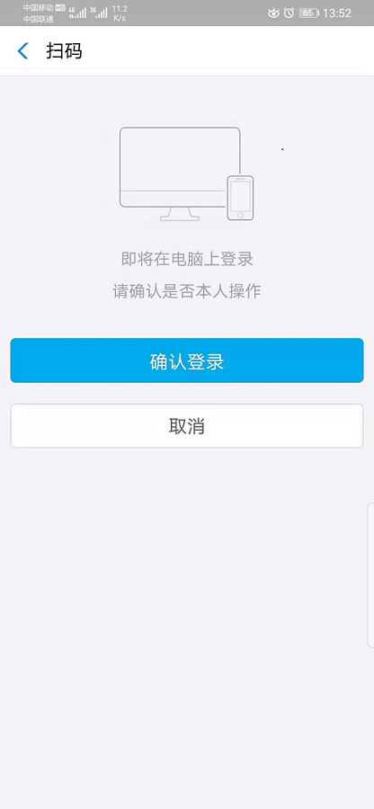

手机端点击确认后，web端将会跳转到授权认证页面

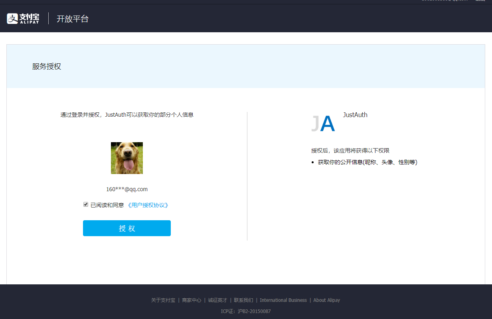

点击同意授权即可完成支付宝的oauth登录。

## 3. 授权结果

```json
{
	"code": 2000,
	"msg": null,
	"data": {
		"uuid": "208xxxxx37",
		"username": "张",
		"nickname": "张",
		"avatar": "https://tfs.alipayobjects.com/images/partner/T1vzlgXj8cXXXXXXXX",
		"blog": null,
		"company": null,
		"location": "北京 北京市",
		"email": null,
		"remark": null,
		"gender": "MALE",
		"source": "ALIPAY",
		"token": {
			"accessToken": "authxxxx2d5b0a182A53",
			"expireIn": 1296000,
			"refreshToken": "authuxxxx4c1b0edb2X53",
			"uid": "208xxxxx37",
			"openId": null,
			"accessCode": null,
			"unionId": null,
			"scope": null,
			"tokenType": null,
			"idToken": null,
			"macAlgorithm": null,
			"macKey": null,
			"code": null,
			"oauthToken": null,
			"oauthTokenSecret": null,
			"userId": null,
			"screenName": null,
			"oauthCallbackConfirmed": null
		}
	}
}
```