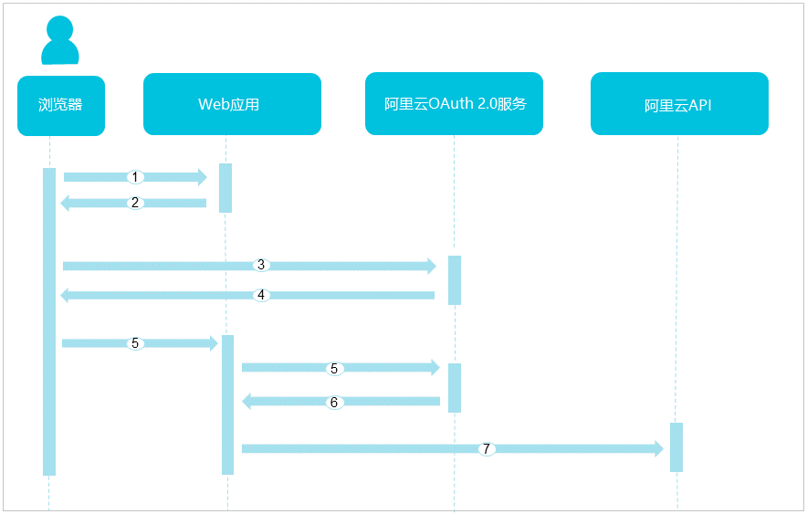
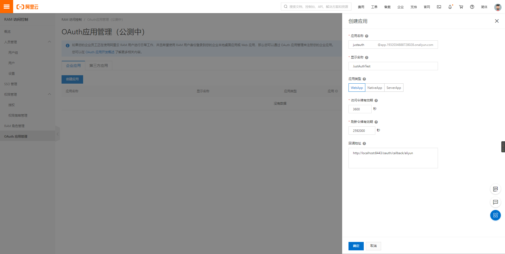
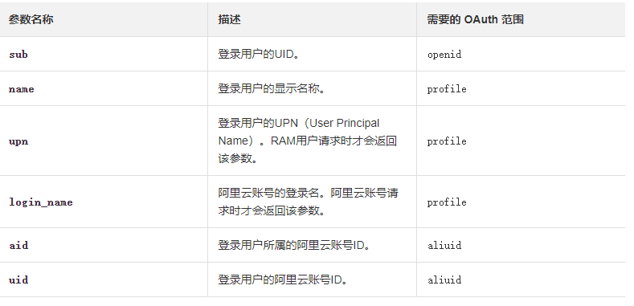
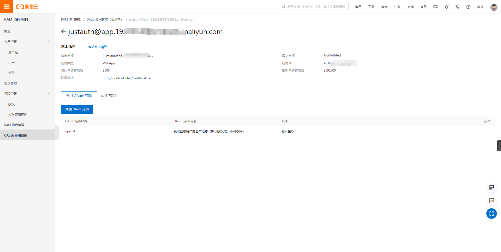
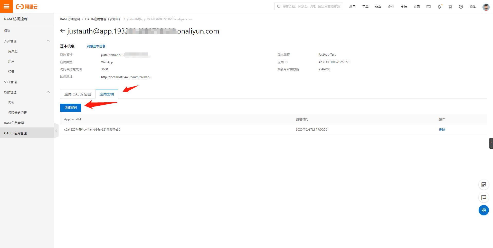

## 1. 授权流程

1. 用户通过浏览器登录Web应用。
2. Web应用重定向到阿里云OAuth 2.0服务并将URL返回给浏览器。
注：如果用户还未登录，则会进一步重定向到阿里云登录服务。
3. 用户通过浏览器登录阿里云OAuth 2.0服务并申请授权码。
4. 阿里云OAuth 2.0服务重定向到Web应用并返回授权码给浏览器。
5. 浏览器通过Web应用使用授权码向阿里云OAuth 2.0服务申请代表用户身份的令牌。
6. 阿里云OAuth 2.0服务向Web应用返回令牌。
7. Web应用通过获取的令牌向阿里云发起访问API的请求。

## 2. 配置应用

### 2.1 创建应用

1. 云账号登录[RAM控制台](https://ram.console.aliyun.com/?spm=a2c4g.11186623.2.8.46a779b5dxuzTy)。
2. 在左侧导航栏，单击OAuth应用管理。
3. 单击创建应用。
4. 输入应用名称和应用显示名称。
5. 选择应用类型。(这儿选择 WebApp 即可)
    - WebApp： 指基于浏览器交互的网络应用。
    - NativeApp：指操作系统中运行的本地应用，主要为运行在桌面操作系统或移动操作系统中的应用。
    - ServerApp：指直接访问阿里云服务，而无需依赖用户登录的应用，目前仅支持基于SCIM协议的用户同步应用。示例请参见[通过SCIM协议将企业内部账号同步到阿里云RAM](https://help.aliyun.com/document_detail/162674.html?spm=a2c4g.11186623.2.9.46a779b5dxuzTy#task-2471389)。
6. 根据需要修改访问令牌有效期时长。    
注：有效期可设置范围为：15分钟至3小时，默认为3600秒。
7. 根据需要修改刷新令牌有效期时长。    
注：有效期可设置范围为：2小时至1年，默认为2592000秒。
8. 输入回调地址。
9. 单击确定完成应用创建。

### 2.2 配置应用 OAuth 范围


如上，除了默认的 openid 外，再单独增加两条 scope：
- aliuid：阿里云颁发的唯一用户标志符
- profile：用户的名称等个人信息

scope 对应获取的用户信息关系表如下：



### 2.3 配置密钥

应用创建完成后，进入应用详情：



切换到 “应用密钥” 选项页，创建密钥



注：密钥创建完成后记得要保存，因为密钥只能在创建完成后明文显示一次，如丢失或者忘记，请重新创建。


**重要提示：“应用密钥”可保护你应用程序的安全，因此请确保其不会泄露！也不要与任何人共享你的“应用密钥”！！！**


## 3. 集成JustAuth


### 3.1 引入依赖

```xml
<dependency>
  <groupId>me.zhyd.oauth</groupId>
  <artifactId>JustAuth</artifactId>
  <version>${latest.version}</version>
</dependency>
```

`${latest.version}`表示当前最新的版本，可以在[这儿](https://github.com/justauth/JustAuth/releases)获取最新的版本信息。

### 3.2 创建Request

```java
AuthRequest authRequest = new AuthAliyunRequest(AuthConfig.builder()
                .clientId("APPID")
                .clientSecret("应用私钥")
                .alipayPublicKey("支付宝公钥")
                .redirectUri("https://www.zhyd.me/oauth/callback/alipay")
                .build());
```

### 3.3 生成授权地址

我们可以直接使用以下方式生成第三方平台的授权链接：
```java
String authorizeUrl = authRequest.authorize(AuthStateUtils.createState());
```
这个链接我们可以直接后台重定向跳转，也可以返回到前端后，前端控制跳转。前端控制的好处就是，可以将第三方的授权页嵌入到iframe中，适配网站设计。


### 3.4 以上完整代码如下

```java
import me.zhyd.oauth.config.AuthConfig;
import me.zhyd.oauth.request.AuthAliyunRequest;
import me.zhyd.oauth.model.AuthCallback;
import me.zhyd.oauth.request.AuthRequest;
import me.zhyd.oauth.utils.AuthStateUtils;
import org.springframework.web.bind.annotation.PathVariable;
import org.springframework.web.bind.annotation.RequestMapping;
import org.springframework.web.bind.annotation.RestController;

import javax.servlet.http.HttpServletResponse;
import java.io.IOException;


@RestController
@RequestMapping("/oauth")
public class RestAuthController {

    @RequestMapping("/render")
    public void renderAuth(HttpServletResponse response) throws IOException {
        AuthRequest authRequest = getAuthRequest();
        response.sendRedirect(authRequest.authorize(AuthStateUtils.createState()));
    }

    @RequestMapping("/callback")
    public Object login(AuthCallback callback) {
        AuthRequest authRequest = getAuthRequest();
        return authRequest.login(callback);
    }

    private AuthRequest getAuthRequest() {
        return new AuthAliyunRequest(AuthConfig.builder()
                   .clientId("APPID")
                   .clientSecret("应用私钥")
                   .redirectUri("回调地址")
                   .build());
    }
}
```

## 4. 授权结果

```json
{
    "code": 2000,
    "msg": null,
    "data": {
        "uuid": "lmwxxxw==",
        "username": "yadong.zhang0415@gmail.com",
        "nickname": "root",
        "avatar": null,
        "blog": null,
        "company": null,
        "location": null,
        "email": null,
        "remark": null,
        "gender": "UNKNOWN",
        "source": "ALIYUN",
        "token": {
            "accessToken": "xxxx",
            "expireIn": 3599,
            "refreshToken": null,
            "uid": null,
            "openId": null,
            "accessCode": null,
            "unionId": null,
            "scope": null,
            "tokenType": "Bearer",
            "idToken": "xxxxx",
            "macAlgorithm": null,
            "macKey": null,
            "code": null,
            "oauthToken": null,
            "oauthTokenSecret": null,
            "userId": null,
            "screenName": null,
            "oauthCallbackConfirmed": null
        },
        "rawUserInfo": {
            "sub": "lmwtxxxZ9ezw==",
            "uid": "193xxx",
            "login_name": "yadong.zhang0415@gmail.com",
            "requestid": "544effc2-f7ba-4ac7-8af4-da2739e50e04",
            "name": "root",
            "bid": "2xxx42",
            "aid": "193xxx"
        }
    }
}
```

## 5. 推荐

官方推荐使用 [JustAuth-demo](https://github.com/justauth/JustAuth-demo) 示例项目进行测试。

使用步骤：
1. clone： [https://github.com/justauth/JustAuth-demo.git](https://github.com/justauth/JustAuth-demo.git)
2. 将上面申请的应用信息填入到`RestAuthController#getAuthRequest`方法的对应位置中：

3. 启动项目，访问 [http://localhost:8443](http://localhost:8443)
4. 选择对应的平台进行授权登录

5. 登录完成后，可以访问[http://localhost:8443/users](http://localhost:8443/users)查看已授权的用户


注：
1. 如果直接使用 JustAuth-demo 项目进行测试，那么在配置测试应用的“回调地址”时要严格按照以下格式配置：`http://localhost:8443/oauth/callback/{平台名}`
2. 平台名参考 `JustAuthPlatformInfo` 枚举类 `names`
