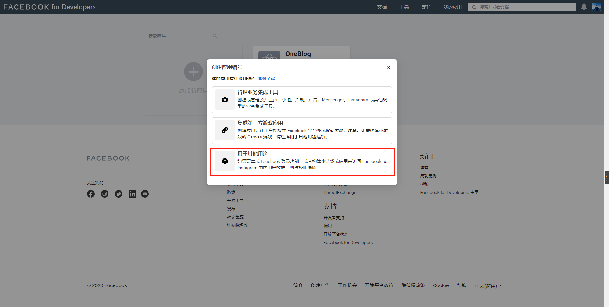
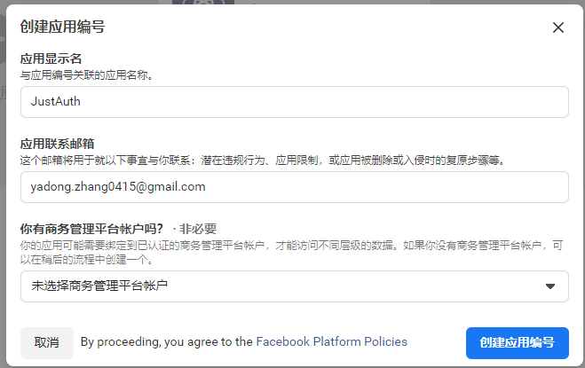
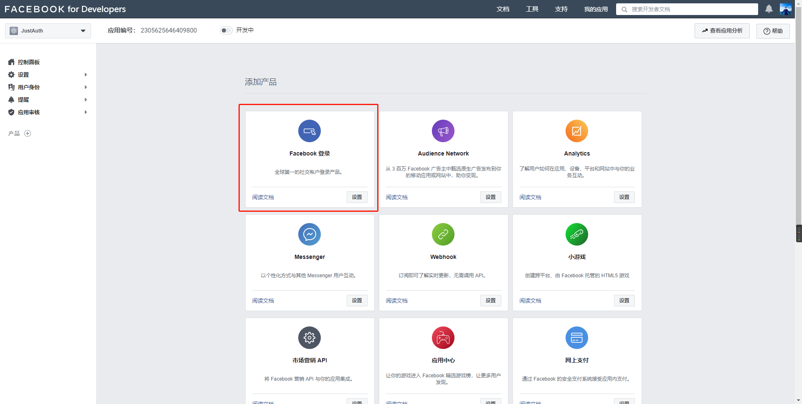
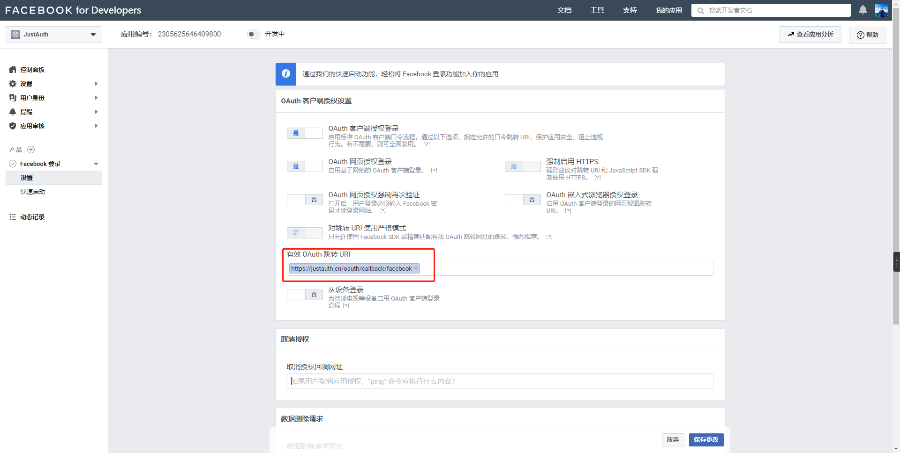
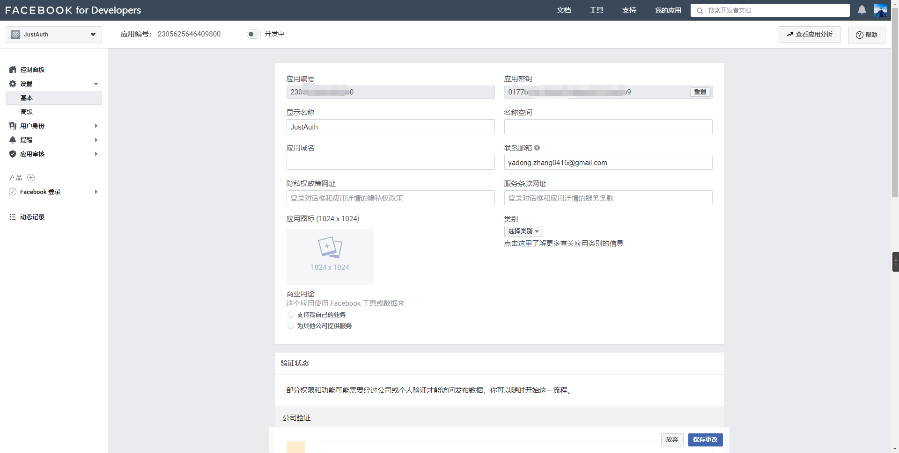
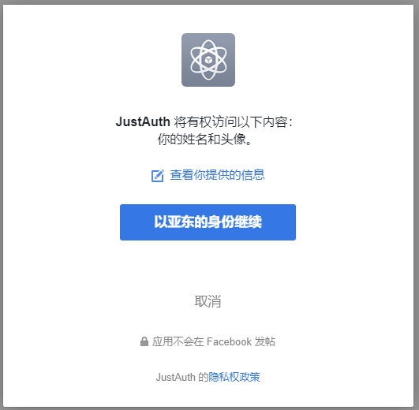

## 1. 申请应用

### 1.1 创建第三方授权应用

1. 登录 Facebook 开发者中心：[Facebook 开发者中心](https://developers.facebook.com/)
2. 进入“我的应用”管理页面
3. 点击“添加新应用”，在弹窗中选择“用于其他用途”    
    
4. 按照提示，创建应用编号    

5. 在应用详情页面，选择“Facebook 登录”    
    
6. 配置“Facebook 登录”的回调地址

7. 获取`Client ID`和`Client Secret`
点击左侧菜单“设置 - 基本”即可看到认证密钥



记录以下三个信息：`Client ID`、`Client Secret`和`回调地址`，后面我们会用到。

**重要提示：“应用密钥”可保护你应用程序的安全，因此请确保其不会泄露！也不要与任何人共享你的“应用密钥”！！！**

## 2. 集成JustAuth

### 2.1 引入依赖

```xml
<dependency>
  <groupId>me.zhyd.oauth</groupId>
  <artifactId>JustAuth</artifactId>
  <version>${latest.version}</version>
</dependency>
```

`${latest.version}`表示当前最新的版本，可以在[这儿](https://github.com/justauth/JustAuth/releases)获取最新的版本信息。

### 2.2 创建Request

```java
AuthRequest authRequest = new AuthFacebookRequest(AuthConfig.builder()
                .clientId("Client ID")
                .clientSecret("Client Secret")
                .redirectUri("应用回调地址")
                // 针对国外平台配置代理
                .httpConfig(HttpConfig.builder()
                        .timeout(15000)
                        // host 和 port 请修改为开发环境的参数
                        .proxy(new Proxy(Proxy.Type.HTTP, new InetSocketAddress("127.0.0.1", 10080)))
                        .build())
                .build());
```

### 2.3 生成授权地址

我们可以直接使用以下方式生成第三方平台的授权链接：
```java
String authorizeUrl = authRequest.authorize(AuthStateUtils.createState());
```
这个链接我们可以直接后台重定向跳转，也可以返回到前端后，前端控制跳转。前端控制的好处就是，可以将第三方的授权页嵌入到iframe中，适配网站设计。


### 2.4 以上完整代码如下

```java
import me.zhyd.oauth.config.AuthConfig;
import me.zhyd.oauth.request.AuthFacebookRequest;
import me.zhyd.oauth.model.AuthCallback;
import me.zhyd.oauth.request.AuthRequest;
import me.zhyd.oauth.utils.AuthStateUtils;
import org.springframework.web.bind.annotation.PathVariable;
import org.springframework.web.bind.annotation.RequestMapping;
import org.springframework.web.bind.annotation.RestController;

import javax.servlet.http.HttpServletResponse;
import java.io.IOException;
import java.net.InetSocketAddress;
import java.net.Proxy;


@RestController
@RequestMapping("/oauth")
public class RestAuthController {

    @RequestMapping("/render")
    public void renderAuth(HttpServletResponse response) throws IOException {
        AuthRequest authRequest = getAuthRequest();
        response.sendRedirect(authRequest.authorize(AuthStateUtils.createState()));
    }

    @RequestMapping("/callback")
    public Object login(AuthCallback callback) {
        AuthRequest authRequest = getAuthRequest();
        return authRequest.login(callback);
    }

    private AuthRequest getAuthRequest() {
        return new AuthFacebookRequest(AuthConfig.builder()
                .clientId("Client ID")
                .clientSecret("Client Secret")
                .redirectUri("回调地址")
                // 针对国外平台配置代理
                .httpConfig(HttpConfig.builder()
                        .timeout(15000)
                        // host 和 port 请修改为开发环境的参数
                        .proxy(new Proxy(Proxy.Type.HTTP, new InetSocketAddress("127.0.0.1", 10080)))
                        .build())
                .build());
    }
}
```
授权链接访问成功后会看到以下页面内容：



点击“连接”即可完成 OAuth 登录。

## 3. 授权结果

注：数据已脱敏

```json
{
    "code":2000,
    "data":{
        "avatar":"https://platform-lookaside.fbsbx.com/platform/profilepic/?asid=27692792&width=400&ext=1595947235&hash=AeS4-5s-I7w4xQq6",
        "gender":"UNKNOWN",
        "nickname":"张亚东",
        "rawUserInfo":{
            "name":"张亚东",
            "id":"27692792",
            "picture":{
                "data":{
                    "is_silhouette":false,
                    "width":480,
                    "url":"https://platform-lookaside.fbsbx.com/platform/profilepic/?asid=27692792&width=400&ext=1595947235&hash=AeS4-5s-I7w4xQq6",
                    "height":480
                }
            }
        },
        "source":"FACEBOOK",
        "token":{
            "accessToken":"",
            "expireIn":5183884,
            "tokenType":"bearer"
        },
        "username":"张亚东",
        "uuid":"27692792"
    }
}

```

## 3. 推荐

官方推荐使用 [JustAuth-demo](https://github.com/justauth/JustAuth-demo) 示例项目进行测试。

使用步骤：
1. clone： [https://github.com/justauth/JustAuth-demo.git](https://github.com/justauth/JustAuth-demo.git)
2. 将上面申请的应用信息填入到`RestAuthController#getAuthRequest`方法的对应位置中：

3. 启动项目，访问 [http://localhost:8443](http://localhost:8443)
4. 选择对应的平台进行授权登录

5. 登录完成后，可以访问[http://localhost:8443/users](http://localhost:8443/users)查看已授权的用户


注：
1. 如果直接使用 JustAuth-demo 项目进行测试，那么在配置测试应用的“回调地址”时要严格按照以下格式配置：`http://localhost:8443/oauth/callback/{平台名}`
2. 平台名参考 `JustAuthPlatformInfo` 枚举类 `names`


