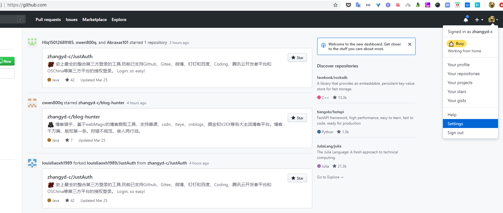
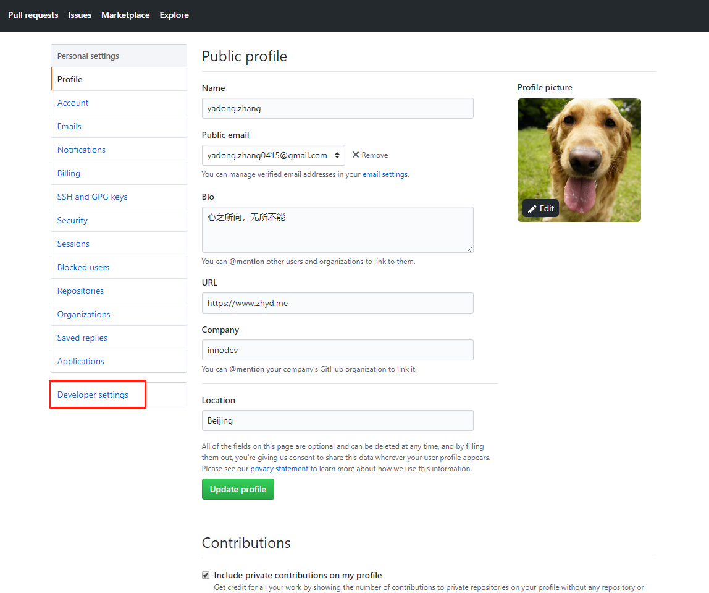
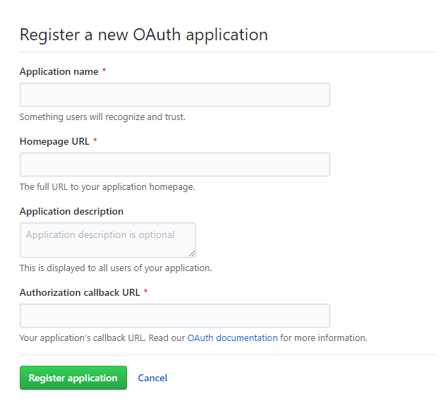
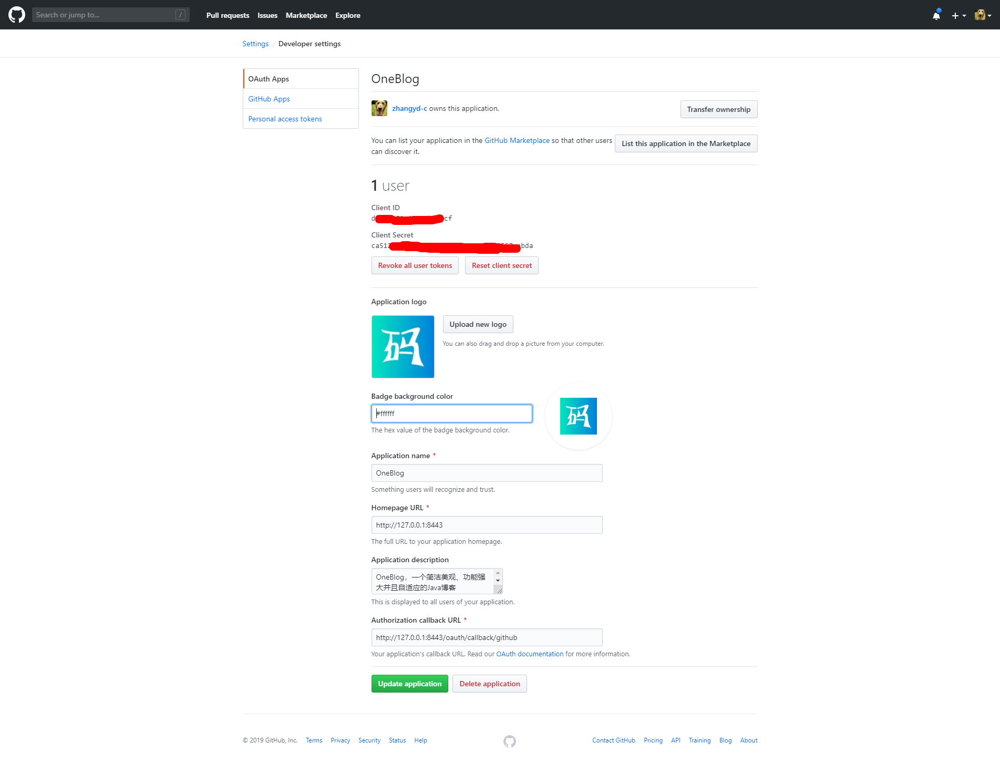
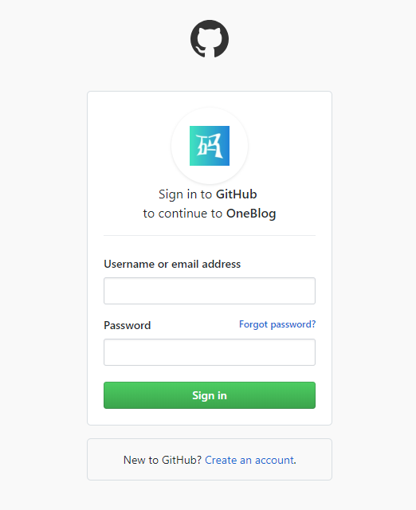
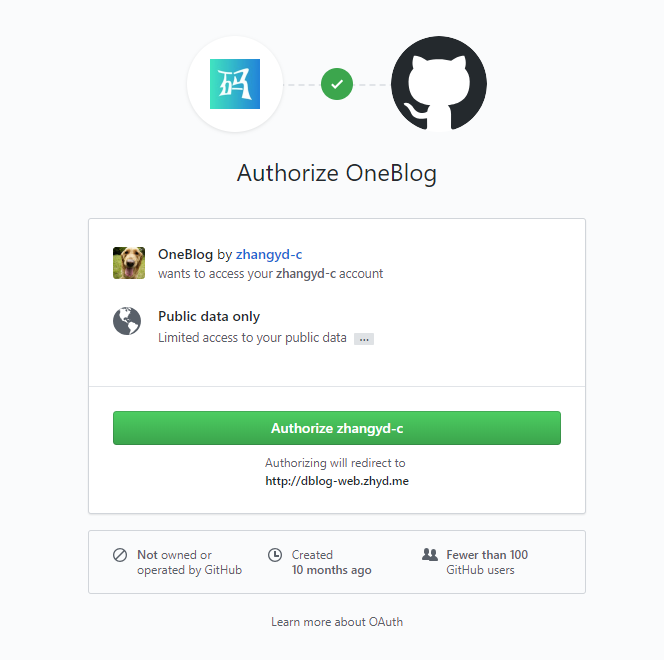
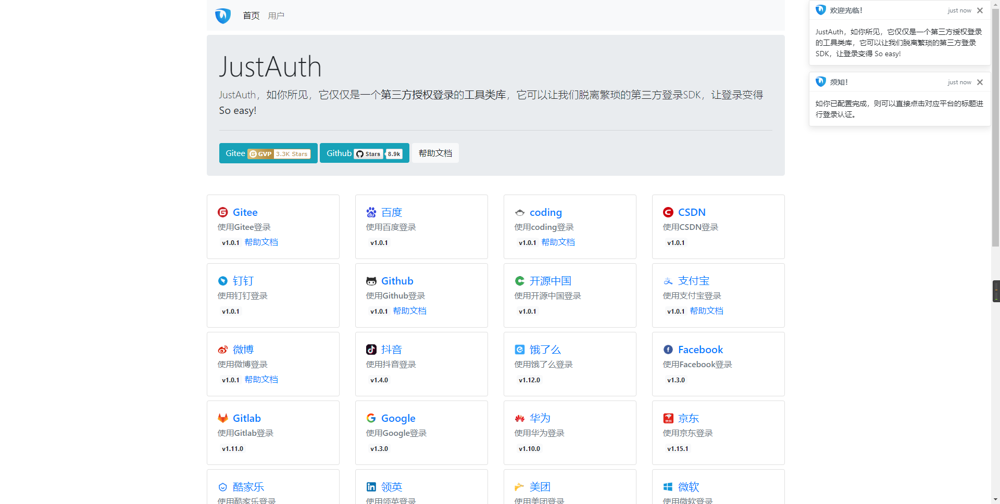

## 1. 申请应用

### 1.注册Github账号
https://github.com/。如果已有则忽略该步骤，直接进入第二步。
### 2.创建第三方应用
进入通过右上角进入个人设置页：https://github.com/settings/profile

然后进入第三方应用页面：https://github.com/settings/developers


在应用管理页面，选择`OAuth App`，然后点击右上方的`New OAuth App`按钮进入新建应用页面



`Application name` 一般填写自己的网站名称即可    
`Application description` 一般填写自己的应用描述即可    
`Homepage URL` 填写自己的网站首页地址    
`Authorization callback URL` **重点**，该地址为用户授权后需要跳转到的自己网站的地址，默认携带一个`code`参数  

以上信息输入完成后，点击下方绿色的`Register applaction`按钮创建应用。创建完成后，点击进入应用详情页，可以看到应用的密钥等信息



copy以下三个信息：`Client ID`、`Client Secret`和`Authorization callback URL`。

**重要提示：“应用密钥”可保护你应用程序的安全，因此请确保其不会泄露！也不要与任何人共享你的“应用密钥”！！！**

## 2. 集成JustAuth


### 2.1 引入依赖

```xml
<dependency>
  <groupId>me.zhyd.oauth</groupId>
  <artifactId>JustAuth</artifactId>
  <version>${latest.version}</version>
</dependency>
```

`${latest.version}`表示当前最新的版本，可以在[这儿](https://github.com/justauth/JustAuth/releases)获取最新的版本信息。

### 2.2 创建Request

```java
AuthRequest authRequest = new AuthGithubRequest(AuthConfig.builder()
                .clientId("Client ID")
                .clientSecret("Client Secret")
                .redirectUri("应用回调地址")
                .build());
```

### 2.3 生成授权地址

我们可以直接使用以下方式生成第三方平台的授权链接：
```java
String authorizeUrl = authRequest.authorize(AuthStateUtils.createState());
```
这个链接我们可以直接后台重定向跳转，也可以返回到前端后，前端控制跳转。前端控制的好处就是，可以将第三方的授权页嵌入到iframe中，适配网站设计。


### 2.4 以上完整代码如下

```java
import me.zhyd.oauth.config.AuthConfig;
import me.zhyd.oauth.request.AuthGithubRequest;
import me.zhyd.oauth.model.AuthCallback;
import me.zhyd.oauth.request.AuthRequest;
import me.zhyd.oauth.utils.AuthStateUtils;
import org.springframework.web.bind.annotation.PathVariable;
import org.springframework.web.bind.annotation.RequestMapping;
import org.springframework.web.bind.annotation.RestController;

import javax.servlet.http.HttpServletResponse;
import java.io.IOException;


@RestController
@RequestMapping("/oauth")
public class RestAuthController {

    @RequestMapping("/render")
    public void renderAuth(HttpServletResponse response) throws IOException {
        AuthRequest authRequest = getAuthRequest();
        response.sendRedirect(authRequest.authorize(AuthStateUtils.createState()));
    }

    @RequestMapping("/callback")
    public Object login(AuthCallback callback) {
        AuthRequest authRequest = getAuthRequest();
        return authRequest.login(callback);
    }

    private AuthRequest getAuthRequest() {
        return new AuthGithubRequest(AuthConfig.builder()
                .clientId("Client ID")
                .clientSecret("Client Secret")
                .redirectUri("应用回调地址")
                .build());
    }
}
```
授权链接访问成功后会看到以下页面内容：


输入账号密码登录完成后将会进入授权页面



点击同意授权即可完成github的oauth登录。

## 3. 授权结果

```json
{
  "code": 2000,
  "msg": null,
  "data": {
    "uuid": "xxx",
    "username": "zhangyd-c",
    "nickname": "yadong.zhang",
    "avatar": "https://avatars3.githubusercontent.com/u/12689082?v=4",
    "blog": "https://www.zhyd.me",
    "company": "",
    "location": "Beijing",
    "email": "yadong.zhang0415@gmail.com",
    "remark": "心之所向，无所不能",
    "gender": "UNKNOWN",
    "source": "GITHUB",
    "token": {
      "accessToken": "6bb4228efdxxxxxx578148e3",
      "expireIn": 0,
      "refreshToken": null,
      "uid": null,
      "openId": null,
      "accessCode": null,
      "unionId": null,
      "scope": null,
      "tokenType": "bearer",
      "idToken": null,
      "macAlgorithm": null,
      "macKey": null,
      "code": null
    }
  }
}
```


## 4. 推荐

官方推荐使用 [JustAuth-demo](https://github.com/justauth/JustAuth-demo) 示例项目进行测试。

使用步骤：
1. clone： [https://github.com/justauth/JustAuth-demo.git](https://github.com/justauth/JustAuth-demo.git)
2. 将上面申请的应用信息填入到`RestAuthController#getAuthRequest`方法的对应位置中：

3. 启动项目，访问 [http://localhost:8443](http://localhost:8443)
4. 选择对应的平台进行授权登录

5. 登录完成后，可以访问[http://localhost:8443/users](http://localhost:8443/users)查看已授权的用户


注：
1. 如果直接使用 JustAuth-demo 项目进行测试，那么在配置测试应用的“回调地址”时要严格按照以下格式配置：`http://localhost:8443/oauth/callback/{平台名}`
2. 平台名参考 `JustAuthPlatformInfo` 枚举类 `names`
