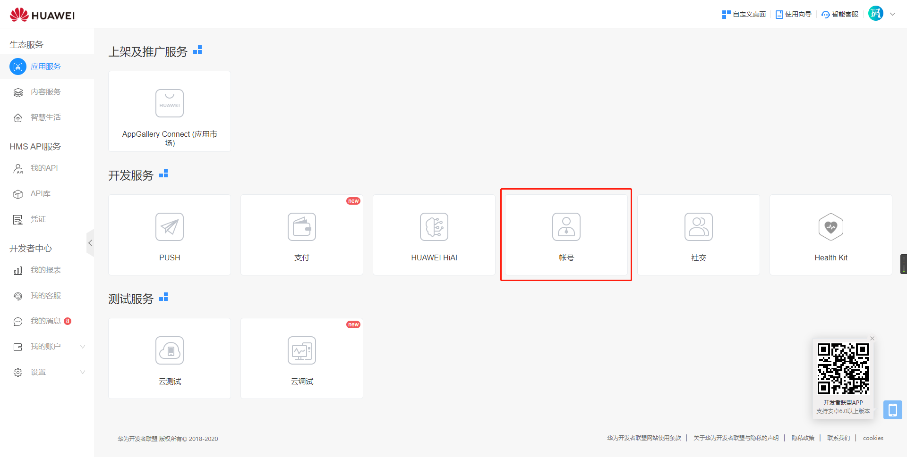
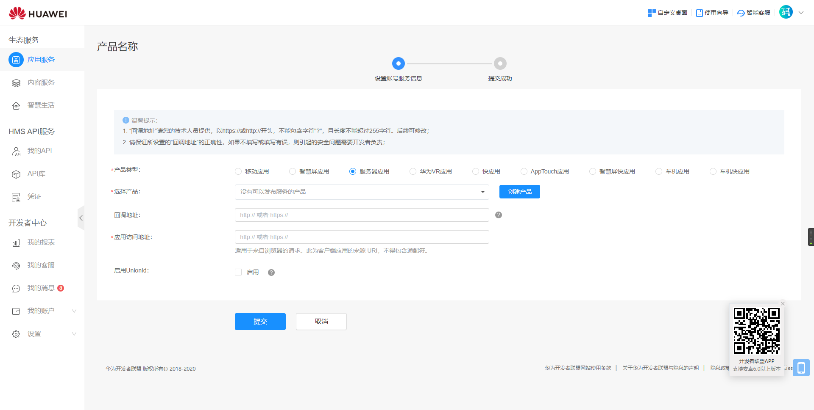
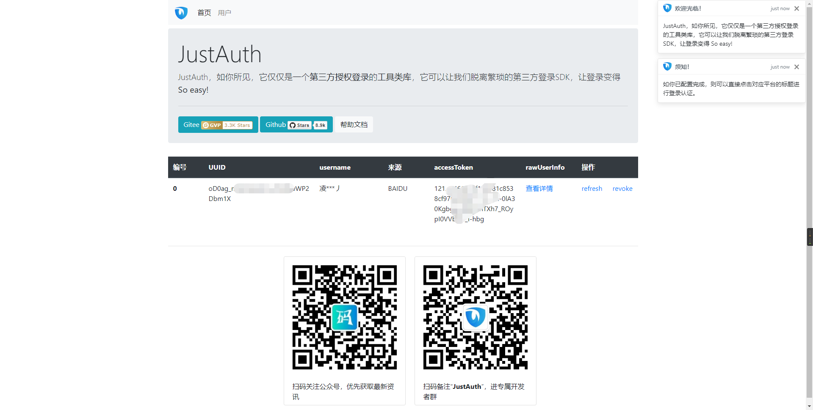

## 1. 申请应用

1. 登录华为开发者联盟官网：[华为开发者联盟官网](https://developer.huawei.com/consumer/cn/)
2. 登录后会自动进入管理控制台    

3. 点击“开发服务”标签下的“账号”，进入应用市场后，选择“我的应用”。

4. 点击右侧的“申请账号服务”

5. 在创建应用页面，选择“**服务器应用**”

    1. 选择产品，如果没有产品，则选择“创建产品”
    
    2. 产品创建完成后会弹出产品 `APP ID` 和 `APP Secret`，注意保存这两个信息
    
    3. 补充应用信息
    
    4. 注意：“启用UnionId”这个选项请根据实际情况勾选
    
    5. 提交应用信息
6. 应用创建完成后，点击进入应用详情页面，查看应用详情


记录以下三个信息：`API ID`、`APP Secret`和`应用回调地址`，后面我们会用到。


**重要提示：“应用密钥”可保护你应用程序的安全，因此请确保其不会泄露！也不要与任何人共享你的“应用密钥”！！！**


## 2. 集成JustAuth

### 2.1 引入依赖

```xml
<dependency>
  <groupId>me.zhyd.oauth</groupId>
  <artifactId>JustAuth</artifactId>
  <version>${latest.version}</version>
</dependency>
```

`${latest.version}`表示当前最新的版本，可以在[这儿](https://github.com/justauth/JustAuth/releases)获取最新的版本信息。

### 2.2 创建Request

```java
AuthRequest authRequest = new AuthHuaweiRequest(AuthConfig.builder()
                .clientId("Client ID")
                .clientSecret("Client Secret")
                .redirectUri("应用回调地址")
                .build());
```

### 2.3 生成授权地址

我们可以直接使用以下方式生成第三方平台的授权链接：
```java
String authorizeUrl = authRequest.authorize(AuthStateUtils.createState());
```
这个链接我们可以直接后台重定向跳转，也可以返回到前端后，前端控制跳转。前端控制的好处就是，可以将第三方的授权页嵌入到iframe中，适配网站设计。


### 2.4 以上完整代码如下

```java
import me.zhyd.oauth.config.AuthConfig;
import me.zhyd.oauth.request.AuthHuaweiRequest;
import me.zhyd.oauth.model.AuthCallback;
import me.zhyd.oauth.request.AuthRequest;
import me.zhyd.oauth.utils.AuthStateUtils;
import org.springframework.web.bind.annotation.PathVariable;
import org.springframework.web.bind.annotation.RequestMapping;
import org.springframework.web.bind.annotation.RestController;

import javax.servlet.http.HttpServletResponse;
import java.io.IOException;


@RestController
@RequestMapping("/oauth")
public class RestAuthController {

    @RequestMapping("/render")
    public void renderAuth(HttpServletResponse response) throws IOException {
        AuthRequest authRequest = getAuthRequest();
        response.sendRedirect(authRequest.authorize(AuthStateUtils.createState()));
    }

    @RequestMapping("/callback")
    public Object login(AuthCallback callback) {
        AuthRequest authRequest = getAuthRequest();
        return authRequest.login(callback);
    }

    private AuthRequest getAuthRequest() {
        return new AuthHuaweiRequest(AuthConfig.builder()
                .clientId("API ID")
                .clientSecret("APP Secret")
                .redirectUri("应用回调地址")
                .build());
    }
}
```
授权链接访问成功后会看到以下页面内容：


点击“授权并登录”即可完成 OAuth 登录。

## 3. 授权结果

注：数据已脱敏

```json
{
    "code":2000,
    "data":{
        "avatar":"https://upfile-drcn.platform.hicloud.com/FileServer/image/b.0260086000226601572.20190415065228.iBKdTsqaNkdPXSz4N7pIRWAgeu45ec3k.1000.9A5467309F9284B267ECA33B59D3D7DA4A71BC732D3BB24EC6B880A73DEE9BAB.jpg",
        "gender":"MALE",
        "nickname":"151****xxx",
        "rawUserInfo":{
            "gender":0,
            "userState":1,
            "headPictureURL":"https://upfile-drcn.platform.hicloud.com/FileServer/image/b.0260086000226601572.20190415065228.iBKdTsqaNkdPXSz4N7pIRWAgeu45ec3k.1000.9A5467309F9284B267ECA33B59D3D7DA4A71BC732D3BB24EC6B880A73DEE9BAB.jpg",
            "userValidStatus":1,
            "languageCode":"zh-CN",
            "userName":"151****xxx",
            "userID":"26xxx601572"
        },
        "source":"HUAWEI",
        "token":{
            "accessToken":"CgB6e3x9tVIxxxxWHYgHkYdqH6o=",
            "expireIn":3600,
            "refreshToken":"CgB6e3x9hjPgfmxxxxmdHlbEaVj2WM="
        },
        "username":"151****2326",
        "uuid":"2600xxx572"
    }
}
```

## 3. 推荐

官方推荐使用 [JustAuth-demo](https://github.com/justauth/JustAuth-demo) 示例项目进行测试。

使用步骤：
1. clone： [https://github.com/justauth/JustAuth-demo.git](https://github.com/justauth/JustAuth-demo.git)
2. 将上面申请的应用信息填入到`RestAuthController#getAuthRequest`方法的对应位置中：

3. 启动项目，访问 [http://localhost:8443](http://localhost:8443)
4. 选择对应的平台进行授权登录

5. 登录完成后，可以访问[http://localhost:8443/users](http://localhost:8443/users)查看已授权的用户


注：
1. 如果直接使用 JustAuth-demo 项目进行测试，那么在配置测试应用的“回调地址”时要严格按照以下格式配置：`http://localhost:8443/oauth/callback/{平台名}`
2. 平台名参考 `JustAuthPlatformInfo` 枚举类 `names`


