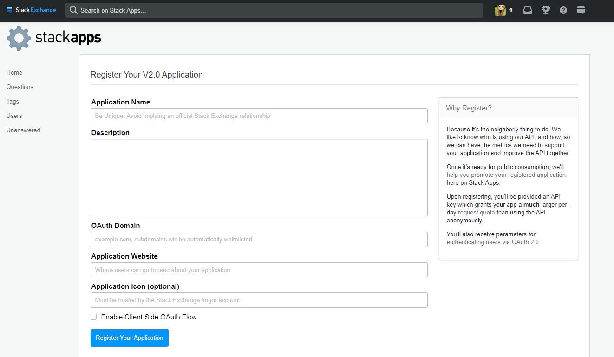
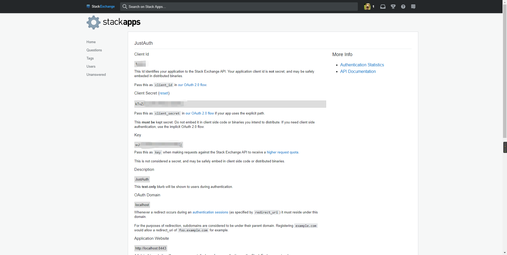
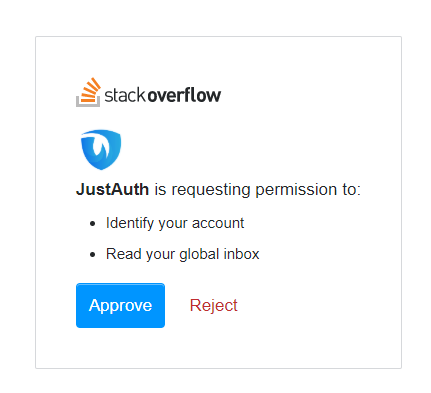
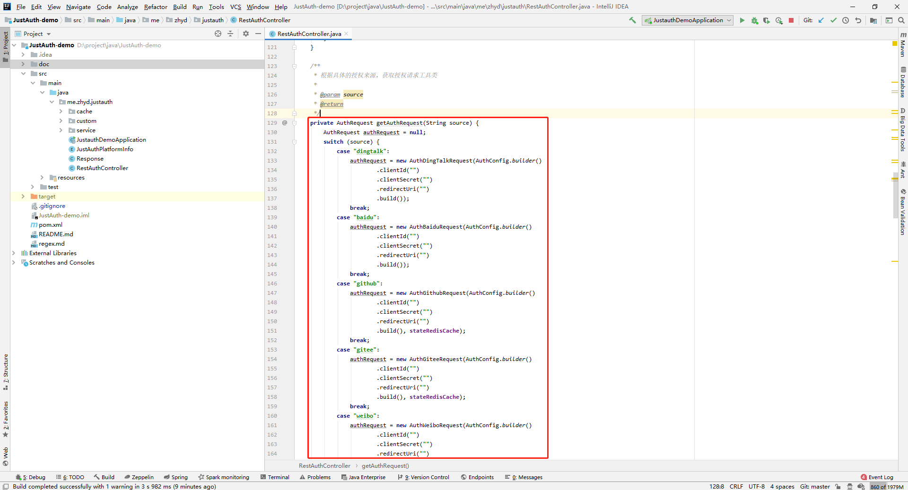
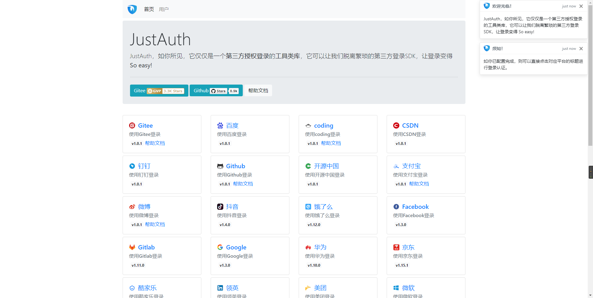

## 1. 申请应用

1. 点击：[注册 OAuth 应用](http://stackapps.com/apps/oauth/register)

2. 创建完成后，会自动进入到应用详情页面

3. 可以通过 [http://stackapps.com/apps/oauth](http://stackapps.com/apps/oauth) 查看以注册的应用。

记录以下三个信息：`Client Id`、`Client Secret`和`Key`，后面我们会用到。需要注意的一点就是 StackOverflow 平台不需要单独配置“回调地址”，在程序中配置`redirectUri`参数时，只要保证是和 StackOverflow 应用中配置的 `OAuth Domain` 是在同一域下即可，例如：
开放平台配置的 `OAuth Domain` 为 `localhost`， 则 `redirectUri` 可以为 `http://localhost[:任意端口]/[任意后缀]`


**重要提示：“应用密钥”可保护你应用程序的安全，因此请确保其不会泄露！也不要与任何人共享你的“应用密钥”！！！**


## 2. 集成JustAuth

### 2.1 引入依赖

```xml
<dependency>
  <groupId>me.zhyd.oauth</groupId>
  <artifactId>JustAuth</artifactId>
  <version>${latest.version}</version>
</dependency>
```

`${latest.version}`表示当前最新的版本，可以在[这儿](https://github.com/justauth/JustAuth/releases)获取最新的版本信息。

### 2.2 创建Request

```java
AuthRequest authRequest = new AuthStackOverflowRequest(AuthConfig.builder()
                .clientId("Client Id")
                .clientSecret("Client Secret")
                .redirectUri("应用回调地址")
                .stackOverflowKey("Key")
                .build());
```

### 2.3 生成授权地址

我们可以直接使用以下方式生成第三方平台的授权链接：
```java
String authorizeUrl = authRequest.authorize(AuthStateUtils.createState());
```
这个链接我们可以直接后台重定向跳转，也可以返回到前端后，前端控制跳转。前端控制的好处就是，可以将第三方的授权页嵌入到iframe中，适配网站设计。


### 2.4 以上完整代码如下

```java
import me.zhyd.oauth.config.AuthConfig;
import me.zhyd.oauth.request.AuthStackOverflowRequest;
import me.zhyd.oauth.model.AuthCallback;
import me.zhyd.oauth.request.AuthRequest;
import me.zhyd.oauth.utils.AuthStateUtils;
import org.springframework.web.bind.annotation.PathVariable;
import org.springframework.web.bind.annotation.RequestMapping;
import org.springframework.web.bind.annotation.RestController;

import javax.servlet.http.HttpServletResponse;
import java.io.IOException;


@RestController
@RequestMapping("/oauth")
public class RestAuthController {

    @RequestMapping("/render")
    public void renderAuth(HttpServletResponse response) throws IOException {
        AuthRequest authRequest = getAuthRequest();
        response.sendRedirect(authRequest.authorize(AuthStateUtils.createState()));
    }

    @RequestMapping("/callback")
    public Object login(AuthCallback callback) {
        AuthRequest authRequest = getAuthRequest();
        return authRequest.login(callback);
    }

    private AuthRequest getAuthRequest() {
        return new AuthStackOverflowRequest(AuthConfig.builder()
                .clientId("Client Id")
                .clientSecret("Client Secret")
                .redirectUri("应用回调地址")
                .stackOverflowKey("Key")
                .build());
    }
}
```
授权链接访问成功后会看到以下页面内容：


点击“授权并登录”即可完成 OAuth 登录。

## 3. 授权结果

注：数据已脱敏

```json
{
    "code":2000,
    "data":{
        "avatar":"https://lh5.googleusercontent.com/-IIeP7ROzlYU/AAAAAAAAAAI/AAAAAAAAAA8/jzL_wmM7eOE/photo.jpg?sz=128",
        "gender":"UNKNOWN",
        "nickname":"HandsomeBoy丶",
        "rawUserInfo":{
            "reputation_change_quarter":0,
            "link":"https://stackoverflow.com/users/11803957/handsomeboy%e4%b8%b6",
            "last_access_date":1,
            "reputation":1,
            "badge_counts":{
                "gold":0,
                "silver":0,
                "bronze":0
            },
            "creation_date":1,
            "display_name":"HandsomeBoy丶",
            "reputation_change_year":0,
            "is_employee":false,
            "profile_image":"https://lh5.googleusercontent.com/-IIeP7ROzlYU/AAAAAAAAAAI/AAAAAAAAAA8/jzL_wmM7eOE/photo.jpg?sz=128",
            "account_id":1,
            "user_type":"registered",
            "reputation_change_week":0,
            "user_id":1,
            "reputation_change_day":0,
            "reputation_change_month":0
        },
        "source":"STACK_OVERFLOW",
        "token":{
            "accessToken":"sSdhrSxxxx",
            "expireIn":86400
        },
        "uuid":"11xxxx"
    }
}
```

## 3. 推荐

官方推荐使用 [JustAuth-demo](https://github.com/justauth/JustAuth-demo) 示例项目进行测试。

使用步骤：
1. clone： [https://github.com/justauth/JustAuth-demo.git](https://github.com/justauth/JustAuth-demo.git)
2. 将上面申请的应用信息填入到`RestAuthController#getAuthRequest`方法的对应位置中：

3. 启动项目，访问 [http://localhost:8443](http://localhost:8443)
4. 选择对应的平台进行授权登录

5. 登录完成后，可以访问[http://localhost:8443/users](http://localhost:8443/users)查看已授权的用户


注：
1. 如果直接使用 JustAuth-demo 项目进行测试，那么在配置测试应用的“回调地址”时要严格按照以下格式配置：`http://localhost:8443/oauth/callback/{平台名}`
2. 平台名参考 `JustAuthPlatformInfo` 枚举类 `names`


