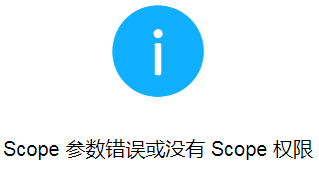
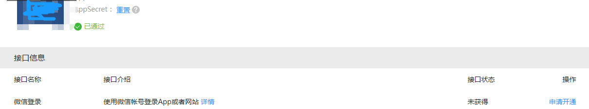
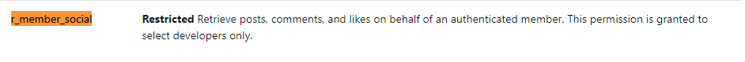
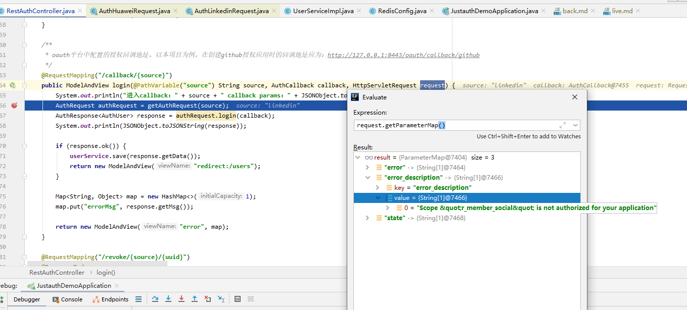
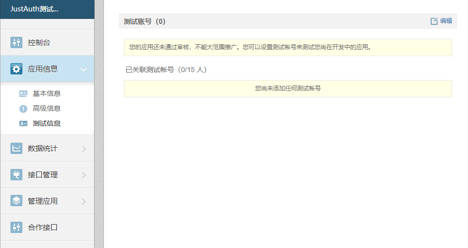
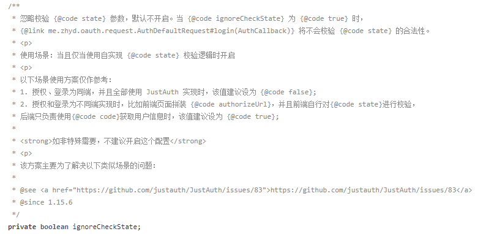

## 升级到1.9.3+版本后编译失败

主要明显的就是`IpUtils.getIp`和request的`.state`报错。

这是因为从`v1.9.3`版本开始，对项目进行了一些优化，具体优化内容参考：[v1.9.3](https://gitee.com/yadong.zhang/JustAuth/releases/v1.9.3)和[v1.9.4](https://gitee.com/yadong.zhang/JustAuth/releases/v1.9.4)。

新版本的使用方式，参考[JustAuth-demo](https://github.com/justauth/JustAuth-demo/blob/master/src/main/java/me/zhyd/justauth/RestAuthController.java)
```
@RequestMapping("/render/{source}")
public void renderAuth(@PathVariable("source") String source, HttpServletResponse response) throws IOException {
	AuthRequest authRequest = getAuthRequest(source);
	String authorizeUrl = authRequest.authorize(AuthStateUtils.createState());
	response.sendRedirect(authorizeUrl);
}
@RequestMapping("/callback/{source}")
public Object login(@PathVariable("source") String source, AuthCallback callback) {
	AuthRequest authRequest = getAuthRequest(source);
	AuthResponse response = authRequest.login(callback);
	return response;
}
```

## 为什么支付宝登录不能用了？

在升级到新版后，使用支付宝登录会提示`ClassNotFoundExcption`异常，这是因为从`1.9.4`版本开始，JustAuth将不在强依赖`alipay-sdk-java`，如果你需要用到Alipay的授权登陆，那么你还需要添加以下依赖：

```
<dependency>
	<groupId>com.alipay.sdk</groupId>
	<artifactId>alipay-sdk-java</artifactId>
	<version>3.7.4.ALL</version>
</dependency>
```

## 微信开放平台提示“Scope参数错误或者Scope没有权限”是怎么回事？

微信开放平台授权登录提示“Scope参数错误或者Scope没有权限”



解决办法：请检查微信开放平台的应用是否有“微信登录”接口的权限。



“接口状态”必须为“已获得”！

## 使用领英登录时回调提示“Illegal code [LINKEDIN]”

发生这种情况，一般就是参数配置错误，导致第三方处理数据时发生异常，因此返回了`error`信息，比如配置了不合适的授权 scope：
```
authRequest = new AuthLinkedinRequest(AuthConfig.builder()
    .clientId("")
    .clientSecret("")
    .redirectUri("http://localhost:8443/oauth/callback/linkedin")
    .scopes(Arrays.asList(
            AuthLinkedinScope.R_LITEPROFILE.getScope(),
            AuthLinkedinScope.R_EMAILADDRESS.getScope(),
            AuthLinkedinScope.W_MEMBER_SOCIAL.getScope(),
            AuthLinkedinScope.R_MEMBER_SOCIAL.getScope()
    ))
    .build());
```
如上scope中多了一个`R_MEMBER_SOCIAL`，查看官方介绍：[share-api](https://docs.microsoft.com/en-us/linkedin/marketing/integrations/community-management/shares/share-api)，    
    
此授权只开放给**开发者**。
另外还可通过断点的形式查找问题如：    
    

## 新浪微博登录报错 403 或者 400

查看控制台是否返回了类似如下异常：
```json
{"error":"applications over the unaudited use restrictions!","error_code":21321,"request":"/2/users/show.json"}
```

`21321`异常新浪微博官方解释为“未审核的应用使用人数超过限制” （参考[Error code](https://open.weibo.com/wiki/Error_code  )）。

之所以抛出这个异常，是因为在审核期，新浪**只允许当前申请AppKey的用户进行测试**，其他用户测试的话都会被禁止并返回上面的错误。就是说如果申请应用的微博账号和测试oauth登录的微博账号不是同一个，就会抛出`21321`异常。

如果想要用其他的账号进行测试，可以在新浪应用管理界面：**应用信息->测试信息** 里面添加想要测试的账户就行了，最多可以添加15人。



## Connection Reset 或 Connection timeout

在使用 Github 或者其他国外平台的 OAuth 时，经常碰到 `Connection Reset` 或 `Connection timeout` 异常，这是因为 Q 的原因，

遇到此情况，请在 AuthConfig 中配置 HttpConfig， 详情参考：[快速开始-如何使用-使用国外平台](/quickstart/how-to-use.md?id=%e4%bd%bf%e7%94%a8%e5%9b%bd%e5%a4%96%e5%b9%b3%e5%8f%b0)

## Illegal state xx

异常栈
```
2020-10-31 18:53:00 http-nio-9503-exec-1 me.zhyd.oauth.log.Log(error:45) [ERROR] - Failed to login with oauth authorization.me.zhyd.oauth.exception.AuthException: Illegal state [WECHAT_OPEN]	
at me.zhyd.oauth.utils.AuthChecker.checkState(AuthChecker.java:110)	
at me.zhyd.oauth.request.AuthDefaultRequest.login(AuthDefaultRequest.java:77)
......
```

异常原因

- 单机情况
    - state 默认有效期为3分钟（#[AuthCacheConfig.java](https://gitee.com/yadong.zhang/JustAuth/blob/master/src/main/java/me/zhyd/oauth/cache/AuthCacheConfig.java)），第三方回调会开发者服务器后，因为异常原因在3分钟内没有处理回调请求，此时会抛出该异常。
- 集群情况
    - 默认 state 是缓存到 map 中，当开发者的服务为集群时，不同集群间的内存缓存无法共享，抛出该异常。具体异常流程为：有 AB 两台服务器， A 服务器生成授权链接（同时生成 state 并存到 A 服务器的本机内存中），第三方登录完回调到了 B 服务器，此时 B 服务器内存中没有 state 缓存，并且无法访问到 A 服务器的内存。 系统抛出异常。
- 其他情况
    - 服务部署到云端，通过内网穿透到本机。在云端生成授权链接（同时生成 state 并存到云端服务器的内存中），回调请求穿透到本地，异常流程参考上面 “集群情况”
    
解决方案

- 针对第一种情况，先排查是否存在异常情况，然后具体分析为什么会延迟3分钟（是否本地在进行 DEBUG？是否第三方授权时长时间未点击确认授权）。最后可以适当将[AuthCacheConfig.java#timeout](https://gitee.com/yadong.zhang/JustAuth/blob/master/src/main/java/me/zhyd/oauth/cache/AuthCacheConfig.java) 参数值调高。
- 针对第二三种情况，建议使用[自定义state缓存](../features/customize-the-state-cache.md)
- 【不建议】另外还可以使用临时解决方案：将 [AuthConfig.java#ignoreCheckState](https://gitee.com/yadong.zhang/JustAuth/blob/master/src/main/java/me/zhyd/oauth/config/AuthConfig.java) 参数设为 true。至于为何将该条标注为【不建议】，请参考下图：


